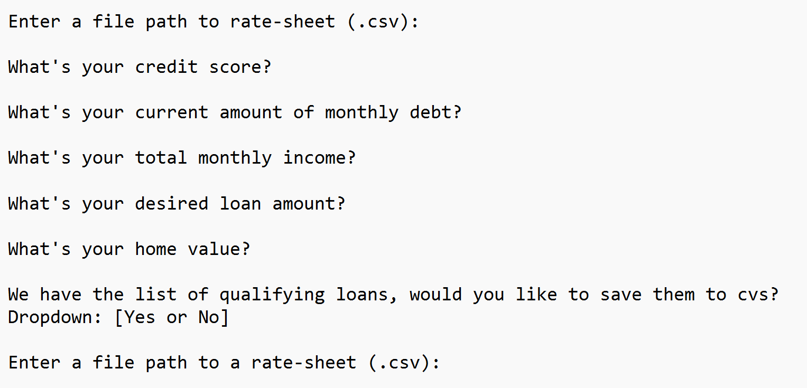
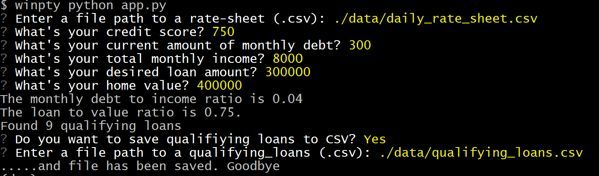

# Loan Qualifier Application

This is a python command-line interface application that allows users to see qualifying loans from lenders quickly and easily. The application works by taking in a `daily_rate_sheet` of loan criteria from various loan providers, asking the user a number of questions to evaluate their loan eligibility, and then returning to them a list of qualifying loans.


---

## Technologies

This project leverages python 3.7 with the following packages:

* [fire](https://github.com/google/python-fire) - For the command line interface, help page, and entrypoint.

* [questionary](https://github.com/tmbo/questionary) - For interactive user prompts and dialogs

---

## Installation Guide

Before running the application first install the following dependencies.

```python
  pip install fire
  pip install questionary
```

---

## Usage

To use the loan qualifier application simply clone the repository and run the **app.py** with:

```python
python app.py

on gitbash you may need to use:

winpty python app.py
```

Upon launching the loan qualifier application you will be greeted with the following prompts.



Respond to the prompts with your information.

Here is what and example of prompts and responses in the CLI.



---

## Contributors

Brought to you by ET Home Loans.

---

## License

MIT